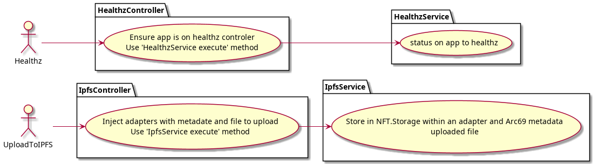

# CLIMATE NFT MARKETPLACE API

Api for climate nft marketplace

## Pull submodules

```
git submodule update --init --recursive
```

# Requirements

**Tested with**

- node: 16.13.2
- yarn: 1.22.17

## Prepare your API

### Create your `.env` file

`cp .env.example .env`

### Install dependencies

`yarn`

## Start app

`yarn start`

## Run tests

`yarn test`

## Use Cases endpoints



## Transferencia de _"assets"_

- Front -> Petición al servidor para hacer _Opt-In_
- Back -> Responde al frontend una vez acabado
  - Se hace la operación firmando desde back con la **wallet del marketplace**
- Front -> Realiza la transferencia una vez tiene el OK
  - Se firma la transferencia con la **wallet del creador/propietario**

(Esto más adelante...)

- Front -> Delete asset (El NFT se ha transferido ya!)
  - Se firma con la wallet del propietario también.

Wallet de marketplace:

```
M32VTQGHNSDPIQE3VXCRSYWFPCUGVHQQPKQPEK5IAGKTJEAGEBRC7QU5OU
```
